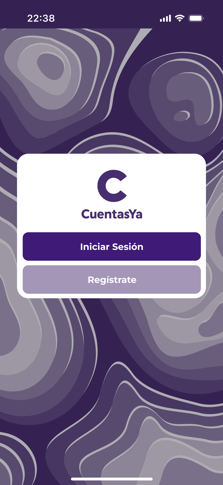
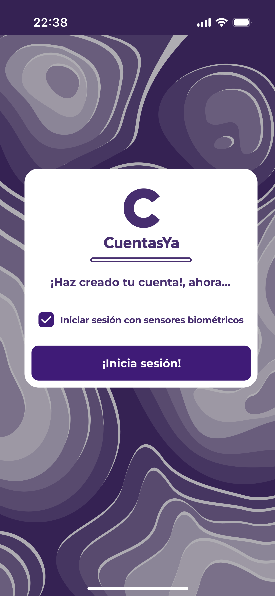

### Register/Login

The application starts asking to the user if this want to log in o register a new account.

   

##### Register
If the user selects the option to register a new account, the application will request the phone number of the user and will request that the terms and conditions be accepted.

   

Then, based on the phone number entered in the previous step, the user will receive a code via SMS to authenticate the phone number. 

   

After this, the user is asked to create a PIN for the account.

  
  

Finally, the user account is created, and the application give the option log in using biometrics sensor of the phone, as the facial recognition if this is available.

##### Login 
Whether by register an account and be redirected, or go directly to the login, this section ask for the user's pin to the user to enter to their account.

  
  
  

# NEXT FEAUTURE: [Main Menu](../Explanation-EN/02.Menu.md)
