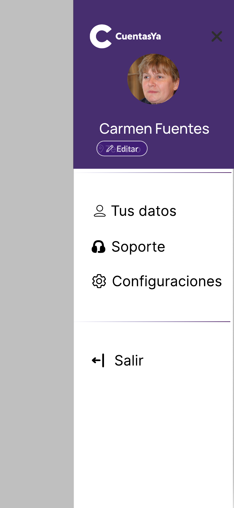
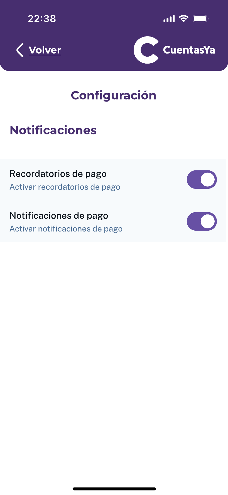

### Profile 

In the main menu, in the upper right corner, there is a profile section, where the associated user can watch and handle their configurations or data.

   

   

### Configuration 

In the configurations, the user can activate options to have reminders of payments and notifications or payments.

# GO BACK TO THE MAIN MENU: ["Main Menu"](../Explanation-EN/02.Menu.md)
