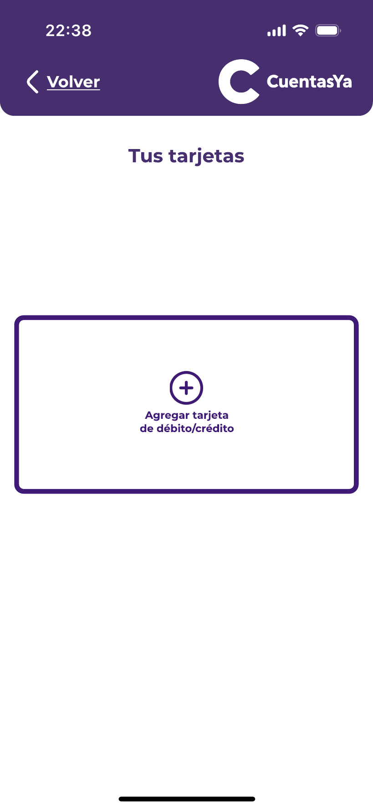

### Your Cards

In this section, it shown to the user a list of all his cards, with a summary of the main data of each one, giving the option to the user to handle these data and cards, whether by deleting, modifying or adding a new card.

   

##### Add 

If the user wants to add a new card, the user must enter the card number, the name of the owner, the CVV and validation date.

   

   

   

   

# GO BACK TO THE MAIN MENU: ["Main Menu"](../Explanation-EN/02.Menu.md)

