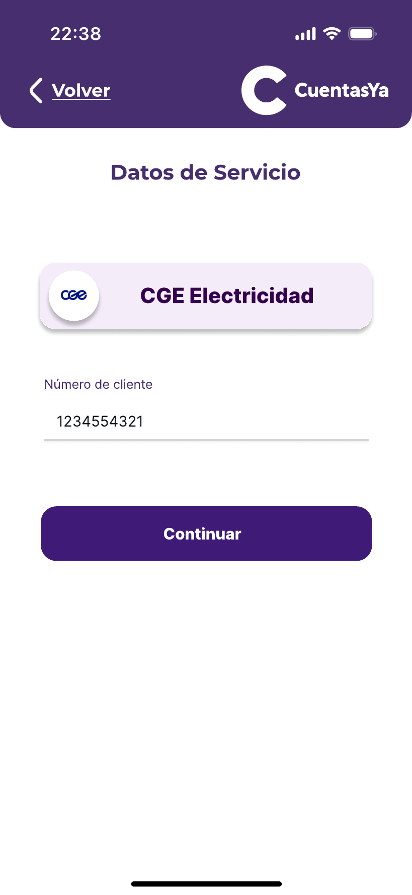
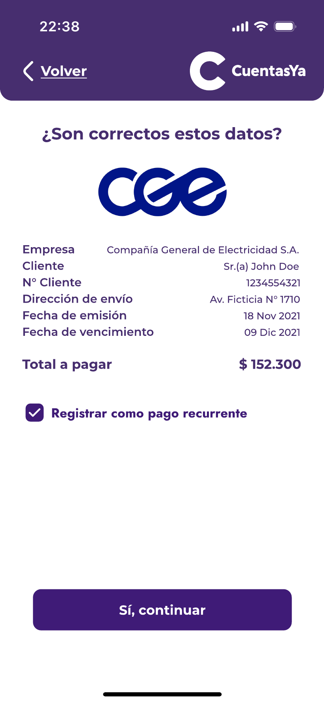

### Services

Based on the location of the user, the application will suggest services around the actual user's location, this with the idea to speed up the process of add a new service.

In this section, the user can choose between two options:

* Find a service manually using the bar.

   

* Find a service via the scan functionality.
> This last one is a functionality that use IA recognition to scan the bill and extract the important data, removing the need to add this manually.

   

   

   

Added the service, the application will display a verification page with the data associated to that service. 
> In this point is necessary to differentiate between the bills that are currently paid, like those paid month to month, and the bills that are unique, like a medical bill.
> The importance of this differentiation lies in the checkbox of this page. This checkbox, if is marked, means that the service is currently paid, for what it is sent to the ["Services"](../Explanation-EN/06.Services.md) to keep the register.

   

Finally, with the service added, the application will ask to the user if this want to pay immediately, sending the user to the ["Bill Center"](../Explanation-EN/08.Bill-Center.md) or pay later, sending the user to the ["Main Menu"](../Explanation-EN/02.Menu.md). 

   

# GO BACK TO THE MAIN MENU: ["Main Menu"](../Explanation-EN/02.Menu.md)
