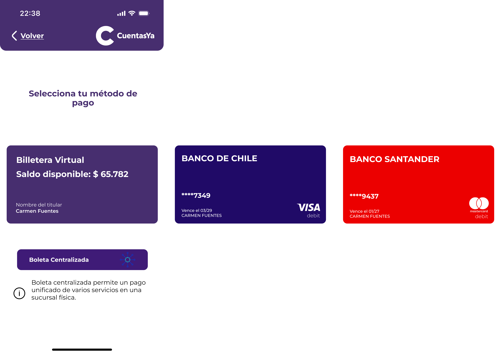

### Payment

In this section, given the bill to pay, the user is asked to select a payment method already registered in the app: 

* Cards.
* Centralized ticket.

   

##### Cards 

If the user chooses a card like a method, the app will asks the CVV of the card, to finally complete the payment process.

  
  
  
  

##### Centralized Ticket 

This ticket is for the users that prefers to go physically to the banks.

The ticket will display a qr that must be carried to any ServiPag or bank, speeding up the payment process.

   

# GO BACK TO THE MAIN MENU: ["Main Menu"](../Explanation-EN/02.Menu.md)
