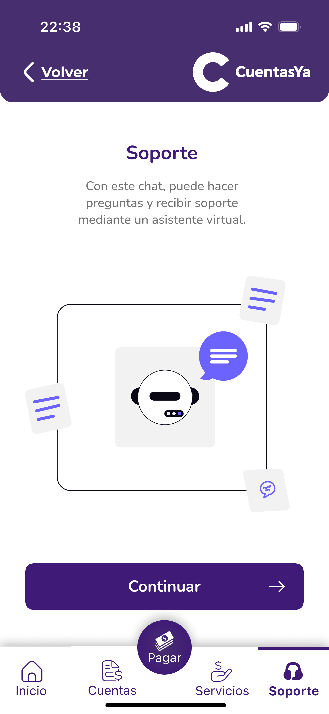
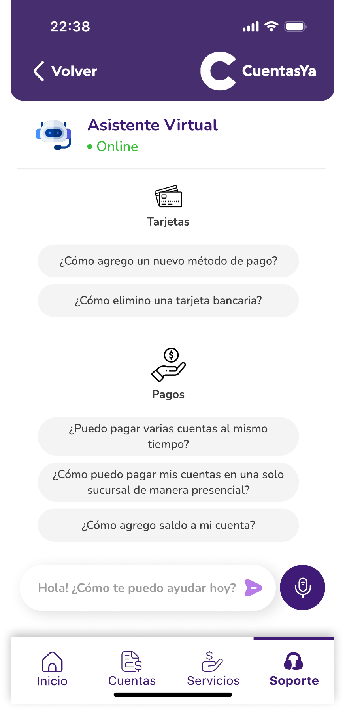

### Support

This section is for that scenarios where the user find difficulties, as don't understand a functionality or not knowing where to go to do a certain action in the app.

This section correspond to a intelligent agent where the user can talk all of his problems, since the agent will take care of respond in the same context without complex words to the user, iterating in a conversational way to until the user is satisfied.

   

   

# GO BACK TO THE MAIN MENU: ["Main Menu"](../Explanation-EN/02.Menu.md)

