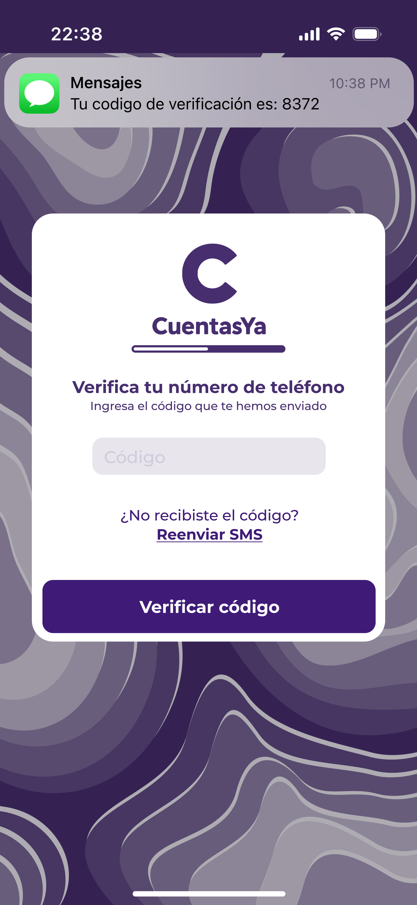

### Registro/Inicio de Sesión

La aplicación empieza preguntando al usuario si desea inciar sesión o crear una nueva cuenta.

   

##### Registro  
Si el usuario selecciona la opción para registar una nueva cuenta, la aplicación solicitará el número teléfonico del usuario, y que este acepte los términos y condiciones de la aplicación.

   

Después, basado en el número teléfonico ingresado en el paso anterior, el usuario recibirá un mensaje SMS con un código de verificación.

   

Después de esto, se le solicita al usuario crear un PIN para su cuenta.

   

   

Finalmente, el usuario es creado, y la aplicación dará la opción de iniciar sesión usando sensores biométricos, como reconicimiento facial, si es que estos están disponibles.

##### Inicio de Sesión 
Ya sea por el registro de una cuenta y ser redireccionado, o ir directamente al inicio de sesión, esta sección solicita el PIN del usuario para ingresar a la cuenta.

   

   

   

# Siguiente Funcionalidad: [Main Menu](../Explanation-EN/02.Menu.md)
