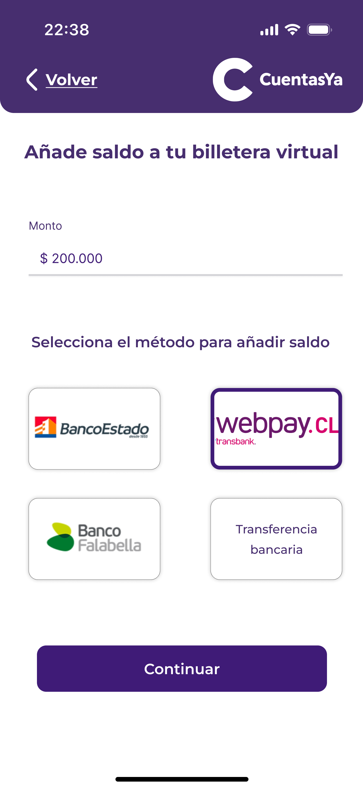

### Billetera Digital  

En esta sección el usuario puede agregar dinero a la billetera digital desde diferentes métodos de pagos.

  
  

Esta billetera digital funciona como método de pago que elimina la complejidad de tener que configurar otros métodos, o el paso adicional del proceso de pago, donde el usuario necesita agregar alguna contraseña o verificación.

# IR AL MENÚ PRINCIPAL: ["Menú Principal"](../Explanation-ES/02.Menu.md)
