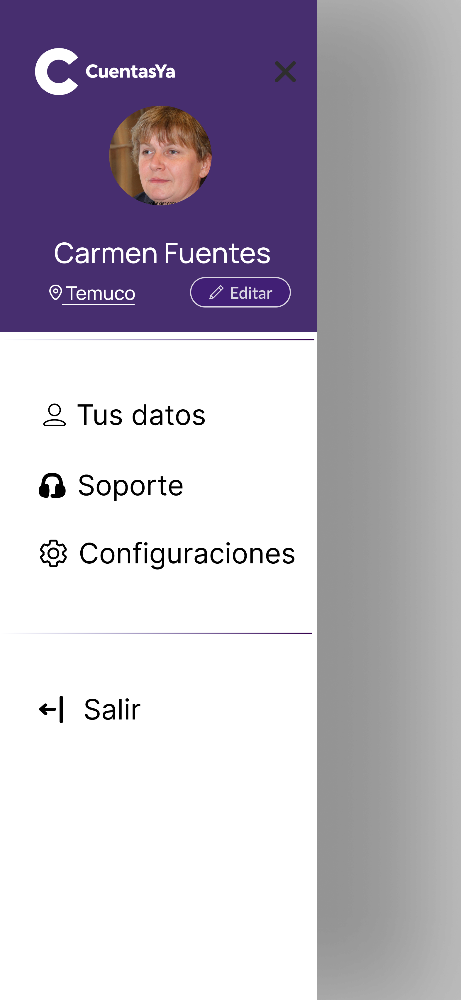

### Perfil 

En el menú principal, en la esquina superior derecha, se encuentra la sección del perfil, donde el usuario asociada a la cuenta puede manejar sus configuraciones e información.

   

### Configuración  

En las configuraciones, el usuario puede activar opciones para tener recordatorios y notificaciones de pago.

   

# IR AL MENÚ PRINCIPAL: ["Menú Principal"](../Explanation-ES/02.Menu.md)
