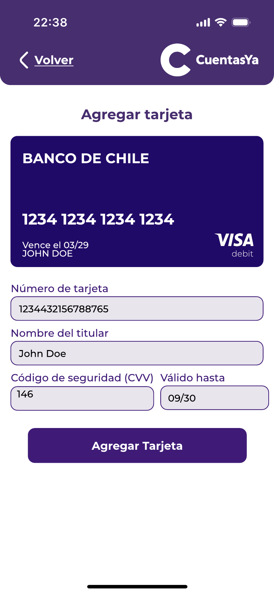

### Tus Tarjetas 

En esta sección, se le muestra al usuario la lista de todas sus tarjetas registradas en la aplicación, con un resumen de la información principal de cada una. Asimismo, el usuario tiene la opción de poder gestionar estas tarjetas, como borrar, modificar y agregar una nueva.

   

##### Agregar 

Si el usuario quiere agregar una nueva tarjeta, deberá ingresar un número de tarjeta, el nombre del dueño, el CVV y la fecha de validación.

  
  
  
  

# IR AL MENÚ PRINCIPAL: ["Menú Principal"](../Explanation-ES/02.Menu.md)
