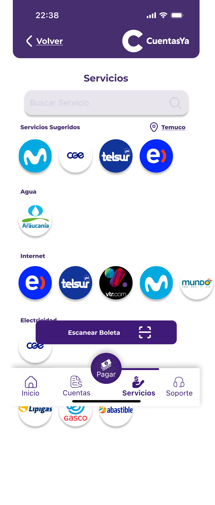
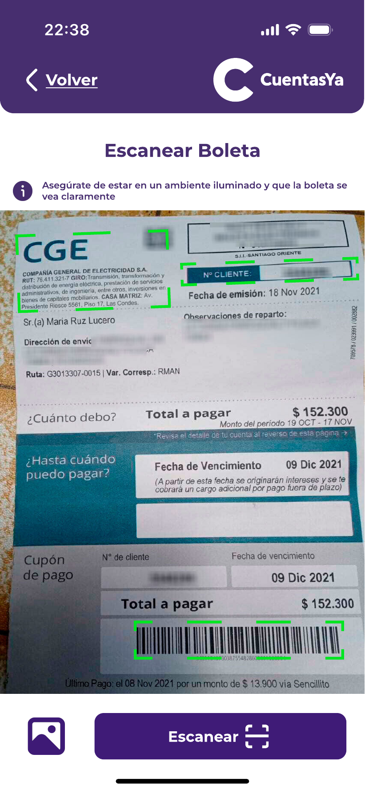

### Servicios  

En base a la ubicación del usuario, la aplicación le recomendará servicios alrededor de este, esto con la idea de obtener mayor velocidad en el proceso de agregar un nuevo servicio.

En esta sección, el usuario puede escoger entre dos opciones:

* Encontrar un servicio manualmente usando la barra de búsqueda:

   

* Encontrar el servicio utilizando la funcionalidad de scan:
> Esta última es una funcionalidad que utiliza IA para escanear la cuenta y extraer la información importante, eliminando la información de agregar esta manualmente.

  
  
  

Agregado el servicio, la aplicación mostrará una página de vertificación con la información asociada a ese servicio.
> En este punto, es necesario diferenciar entre las cuentas que son de pago recurrente, como las que son mes a mes, de las que son únicas, como una cuenta médica.
> La importancia de esta diferenciación yace en el checkbox presente en la página. Con esta checkbox, si se encuentra marcada, signfica que el servicio es de pago recurrente, por lo que es agregado a [«Servicios»](../Explanation-ES/06.Servicios.md) para mantener el registro de esta.

   

Finalmente, con el servicio agregado, la aplicación solicitará al usuario si este quiere pagar inmediatamente, redireccionando al usuario al [«Centro de Cuentas»](../Explanation-ES/08.Centro-Cuentas.md) o pagar después, redireccionando al usuario al [«Menú Principal»](../Explanation-ES/02.Menu.md).

   

# IR AL MENÚ PRINCIPAL: ["Menú Principal"](../Explanation-ES/02.Menu.md)
