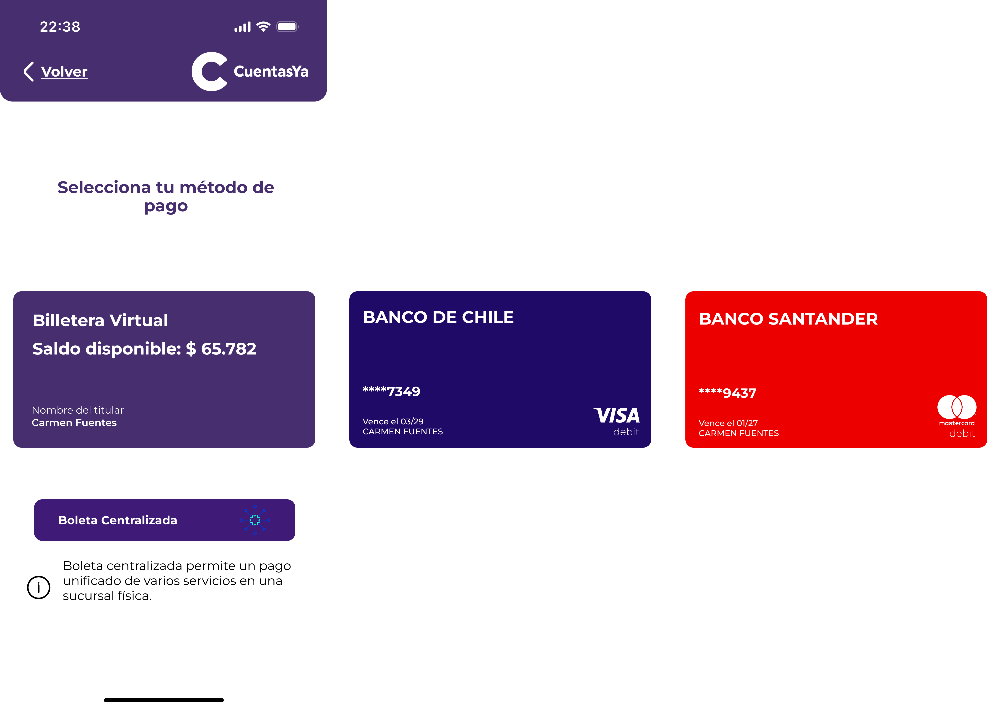
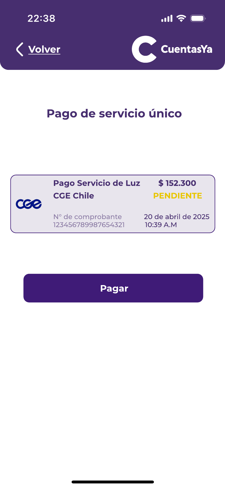
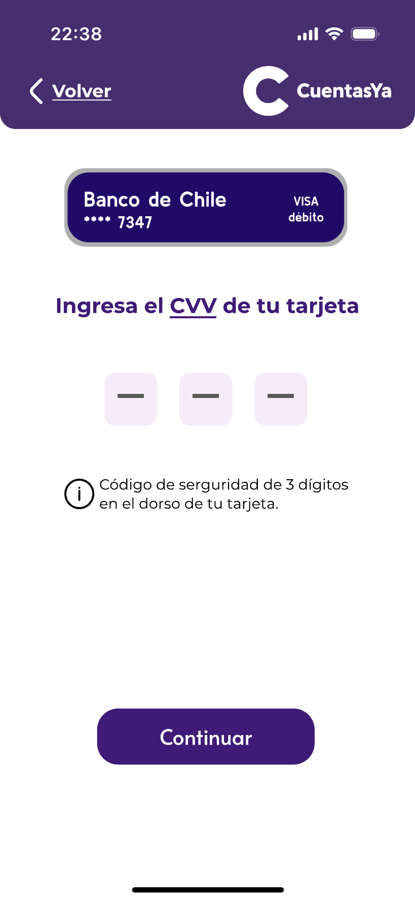
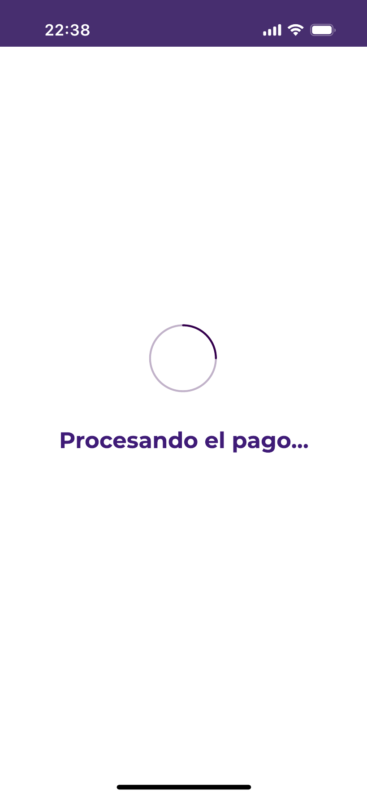
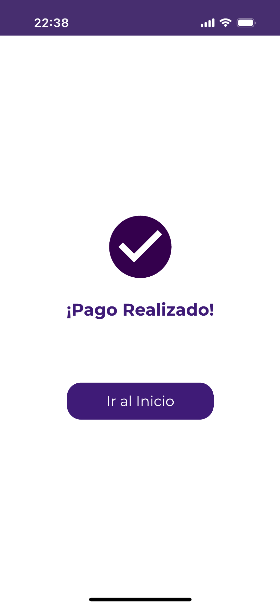

### Pago 

En esta sección, dado la cuenta a pagar, el ususario será preguntado por un método de pago_

* Cards.
* Centralized ticket.

   

##### Tarjetas  

Si el usuario elige una tarjeta como método, la aplicación solicitará el CVV de la tarjeta, para finalmente completar el proceso de pago. 

  
  
  
  

##### Ticket Centralizado  

Este es un ticket para los usuarios que prefieren ir físicamente a los bancos.

El ticket mostrará un QR que deberá ser llemvado a cualquier ServiPag o banco, aumentando la velocidad de pago en el proceso.

   

# Ir al menú principal: ["Menú Principal"](../Explanation-ES/02.Menu.md)
