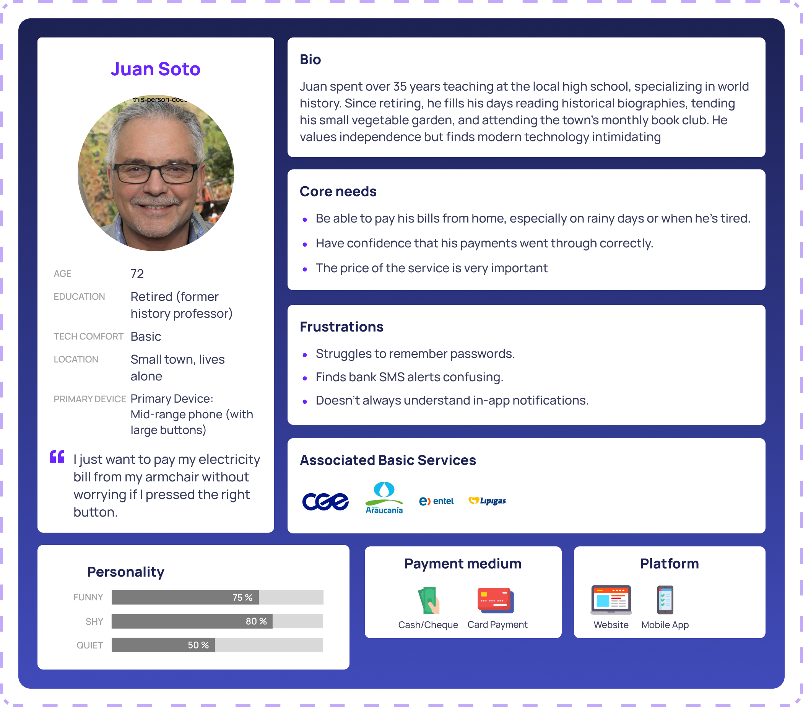
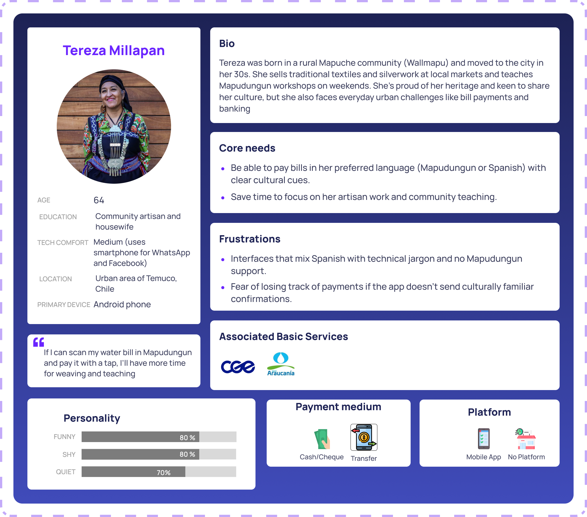
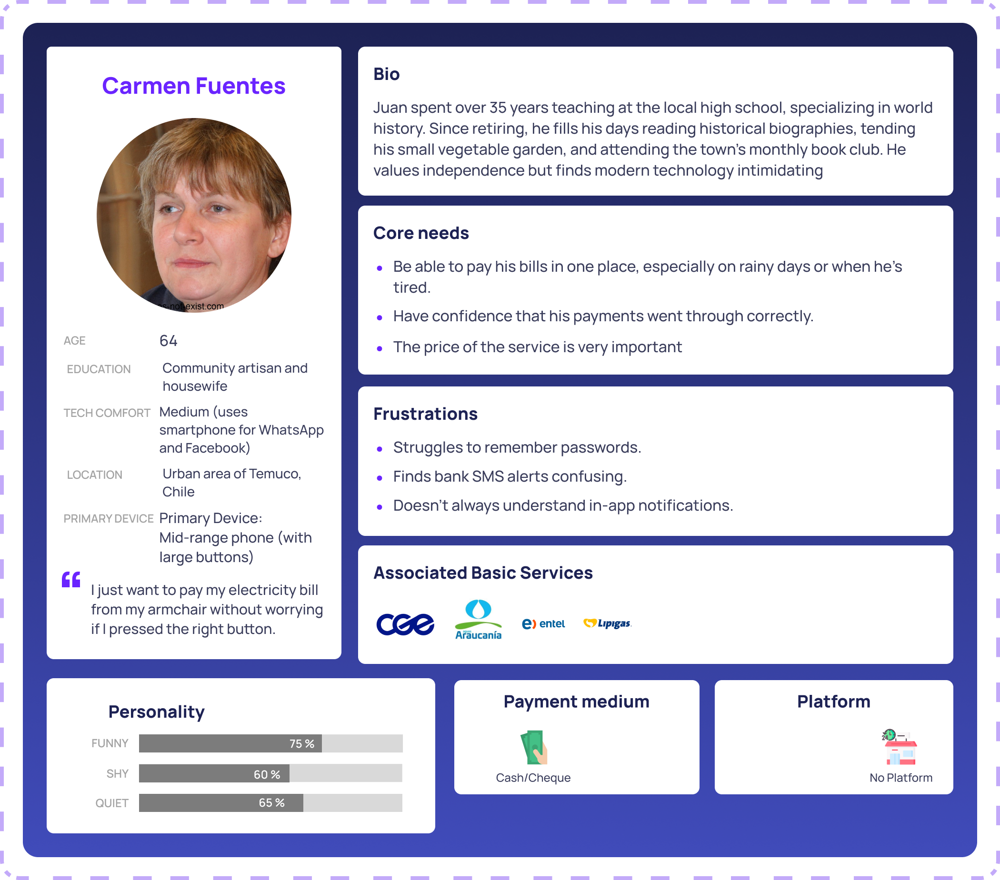
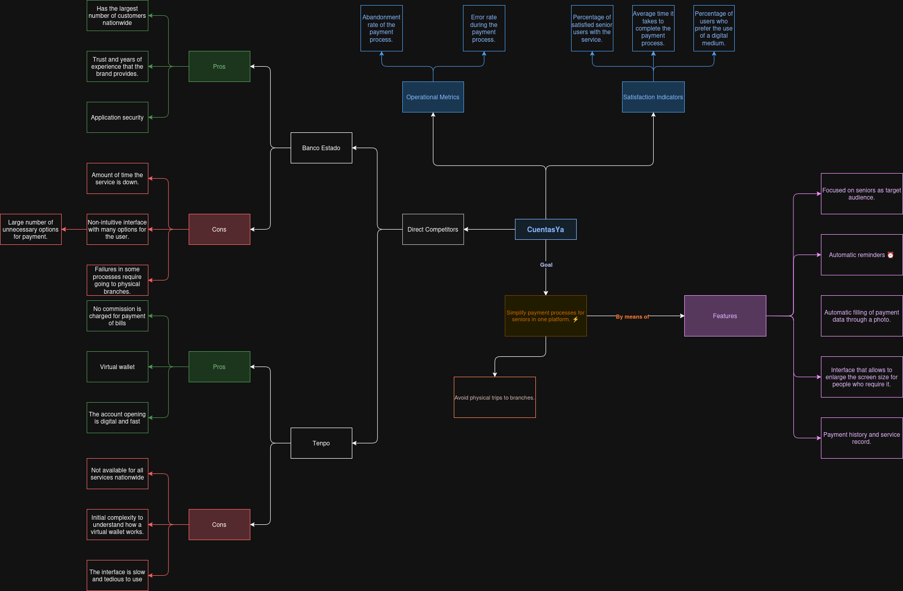
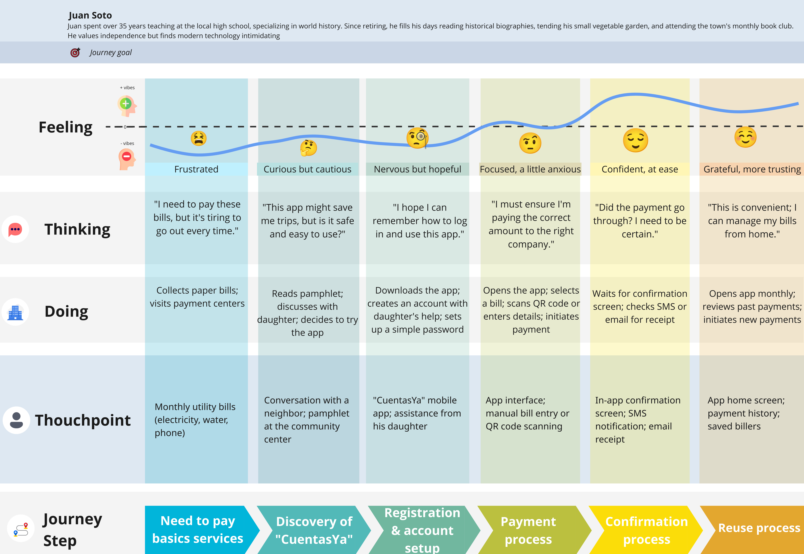
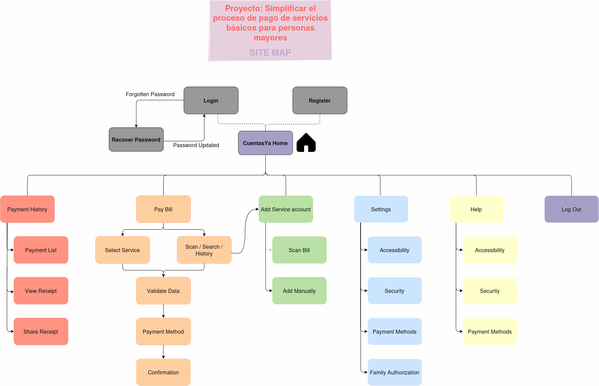
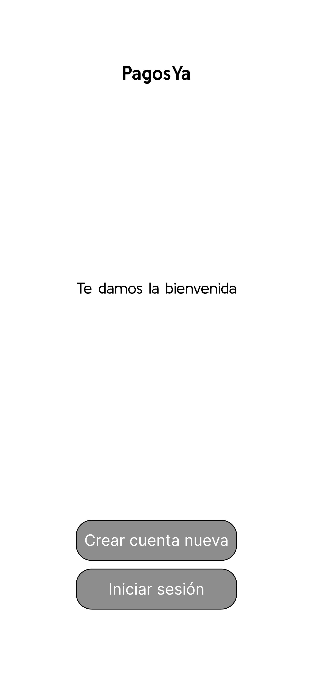
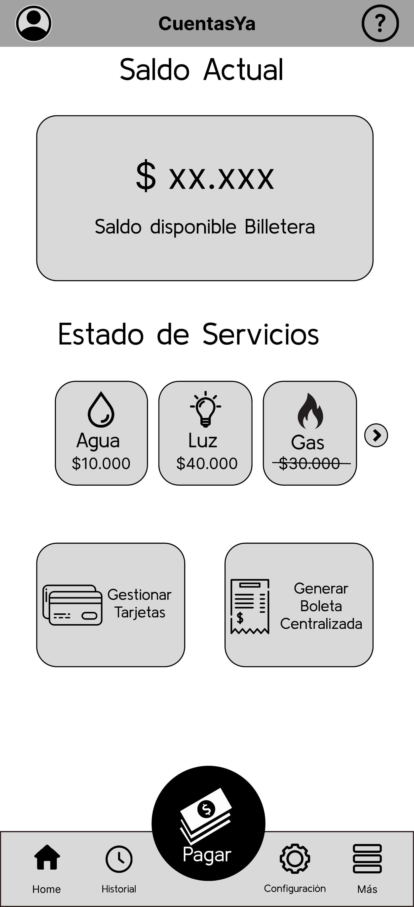
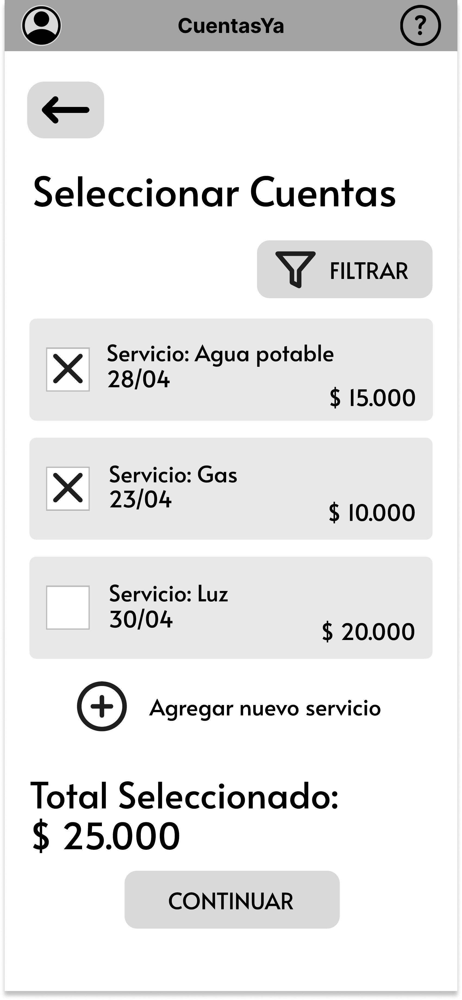

# CuentasYa

**🌐 Languages / Idiomas:** [English](README.md) | [Español](README_ES.md)

This repository contains all the user experience process behind the app 'CuentasYa', focused on the payment of bills for older adults. 

--- 
### Index 

1. [Introduction](#1-introduction)
   - [1.1 Problem Statement](#11-problem-statement)
   - [1.2 Solution](#12-solution)
2. [Team and Roles](#2-team-and-roles)
3. [UX Design Process](#3-ux-design-process)
   - [3.1 Strategy Plane](#31-strategy-plane)
   - [3.2 Scope Plane](#32-scope-plane)
   - [3.3 Structure Plane](#33-structure-plane)
   - [3.4 Skeleton Plane](#34-skeleton-plane)
   - [3.5 Surface Plane](#35-surface-plane)
4. [References](#4-references)

--- 
### 1. Introduction 

##### 1.1 Problem Statement

In the modern world, the bill payment process has changed compared to previous years, where was necessary to go physically to the banks, regardless the size of the affair. 

Currently, we harness the advantages brought by the digitalized world, specifically, the ability to put in a single application all the capabilities that a few years ago, would be necessary to attend physically in a bank.

In this context, even with this new facilities, there are still people who avoid this solutions, whether by difficulties with technology or simply tradition, something totally normal considering how recently this new technology has emerged. Whatever the case may be, we can recognize the big problem of the lack of solutions focused on this segment of people, the older adults.

##### 1.2 Solution  

With our project, named 'CuentasYa' inspired by the issue found, we aim to build a solution focused on our senior citizens, a platform where they can centralized all their bills and cards, avoiding the need to travel physically to the banks. 

The platform will be able to indicate inside the app and with notifications and alarms, all the unpaid bills. Furthermore, the main feature is the payment of bills, whether it is full digital or generating a centralized ticket that can be used in the bank. 

---
### 2. Team and Roles

The team is composed by 5 members, each one with a specific role in the project.
| Name             | Role                      | Description                                                                 |
|------------------|---------------------------|-----------------------------------------------------------------------------|
| Joaquín Faúndez  | Project Manager           | Responsible for the overall project management and coordination.                        | 
| Sebastián Llanos | Analyst                   | Responsible for analyzing user requirements, evaluating data, and translating business needs into technical specifications. |
| Javier Alcalde   | UX Designer               | Responsible for creating user interfaces, user flows, and ensuring a positive user experience throughout the application. |
| Diego Labrín     | Supporter                 | Responsible for providing technical assistance, troubleshooting issues, and supporting the team with various project tasks. |
| Jesús Tapia      | Presenter                 | Responsible for presenting the project and communicating its value to stakeholders. |

---
### 3. UX Design Process

#### 3.1. Strategy Plane

_"Together, product objectives and user needs form the strategy plane, the foundation for every decision in our process as we design the user experience."_ (Garrett, 2011)

In our context, to understand what we want to achieve with this application, and what of users want and expect of our app, we used the tools named as **Value Proposition Canvas** and **Persona Canvas**.

> The **Value Proposition Canvas** was a framework to ensure that there is a fit between the product and market. It is a detailed tool for modeling the relationship between two parts: customer segments and value propositions. (B2B International, 2025)

Additionally, to understand who are our segment of users, we used the tool named as **Persona Canvas**, to understand who are the persons to which the application is intended.

> The **Persona Canvas** is a tool that allow collect data about our users segment, making this group of fragmented data, a character that represent the needs of a segment group, generating that users be more real and not unknown.

#### 3.2. Scope Plane

_"Strategy becomes scope when you translate user needs and product objectives into specific requirements for what content and functionality the product will offer to users."_ (Garrett, 2011)

In the scope plane, to understand what we are building, we study the competitors present in the market, identifing their best features and what makes them good, and their worst features to not replicate them.

To do this, based in the information recopilated in the **strategy plane**, we develop a benchmarking that comparates the most famous competitors and their funcionalities, selecting the best funcionalities that can match with the problems that we try to solve, adding others that can work and help in our domain problem.

> Benchmarking is defined as the process of measuring products, services, and processes against those of organizations known to be leaders in one or more aspects of their operations. (American Society for Quality, n.d.)

For more detailed information about the benchmarking analysis and competitor comparison, please visit the [Benchmark folder](Documents/Benchmark) in this repository.

Materialized the **Persona Canvas**, and defined the funcionalities of the project, we mix this two tools to built a **Customer Journey Map**, a tool that let us understand how our users are going to feel using the system, given the interaction between user and app.

> A **Customer Journey Map** is a visual representation of every experience that a customer has with a brand, product or service. Ideally, a customer journey map captures the customer experience from the consumer perspective, visualizing the touchpoints, emotions and potential pain points they encounter during their relationship with a brand. (Hayes & Downie, 2024)

#### 3.3. Structure Plane 

_"The requirements, however, don’t describe how the pieces fit together to form a cohesive whole. This is the next level up from scope: developing a conceptual structure for the site."_ (Garrett, 2011)

In the context of our application, we used the tool known as a Sitemap, to understand the logical flow of the system through the functionalities that the system will respond to each user interaction. 

> A sitemap is a file that shows the structure of your website, including its pages and content. And the relationships between them. (Pavlik, 2024)

#### 3.4. Skeleton Plane 
_"Defines what form that functionality will take. In addition to addressing more concrete issues of presentation, the skeleton plane deals with matters that involve a more refined level of detail"_ (Garrett, 2011)

In our applications, based on the functionalities defined in the **Sitemap**, we create views for the application using wireframes.

> A **wireframe** is a top-level blueprint that illustrates the structure of your website, app, or project. It doesn’t include any designs or a great deal of detail. It simply maps the structure and the key elements. (Miro, 2025).

   
   
   
   

To see all the wireframes, due to the high number of images, go directly to the [Wireframes Lo-Fi folder](/Documents/Wireframes).

#### 3.5. Surface Plane

_"The surface plane is the most visible part of the user experience. It’s what users see and interact with. The surface plane is where the visual design comes into play."_ (Garrett, 2011)

[Hi-fi Wireframes (Surface Plane folder)](Documents/Mockups)

---
### 4. References

- Garrett, J. J. (2011). The Elements of User Experience: User-Centered Design for the Web and Beyond. New Riders.
- B2B International. (2025). Value Proposition Canvas. Retrieved from https://www.b2binternational.com/research/methods/faq/what-is-the-value-proposition-canvas/
- American Society for Quality. (n.d.). Benchmarking. Retrieved from https://asq.org/quality-resources/benchmarking
- Hayes, M., & Downie, A. (2024, October 11). Customer journey map. Retrieved from https://www.ibm.com/think/topics/customer-journey-map
- Pavlik, V., Shirlow, C., & Mustapic, B. (2024). What Is a Sitemap? Website Sitemaps Explained. Semrush Blog. Retrieved from https://www.semrush.com/blog/website-sitemap
- What is a Wireframe & its Role in the Design Process | Miro. (2025, May 25). Retrieved from https://miro.com/wireframe/what-is-a-wireframe

---

