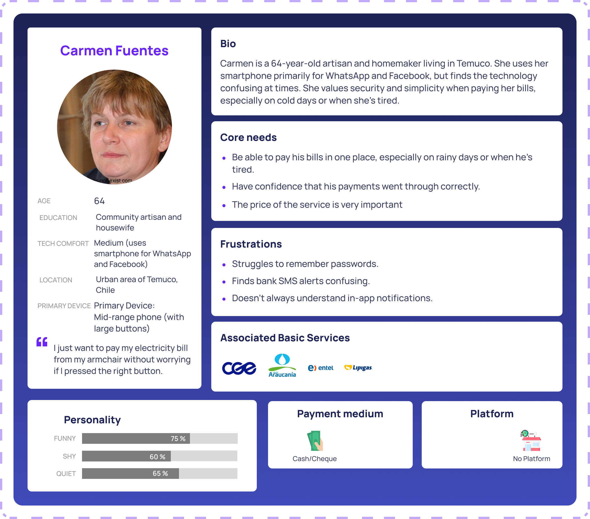
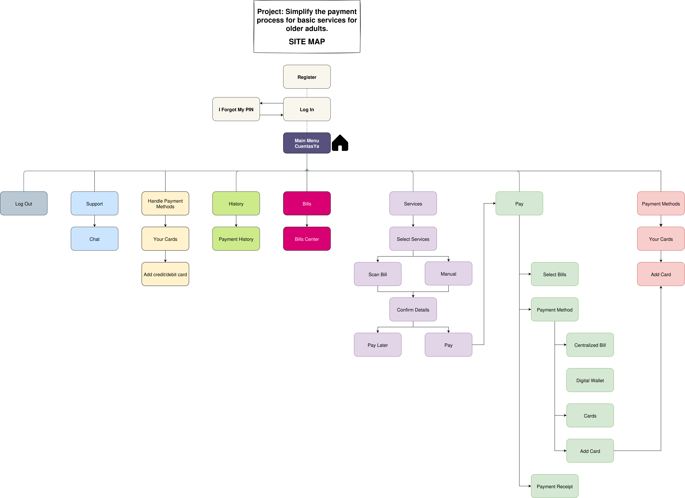
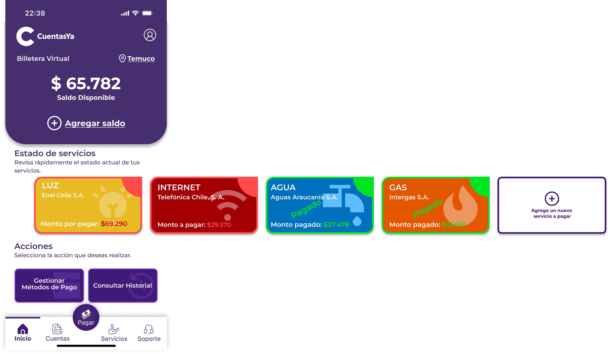
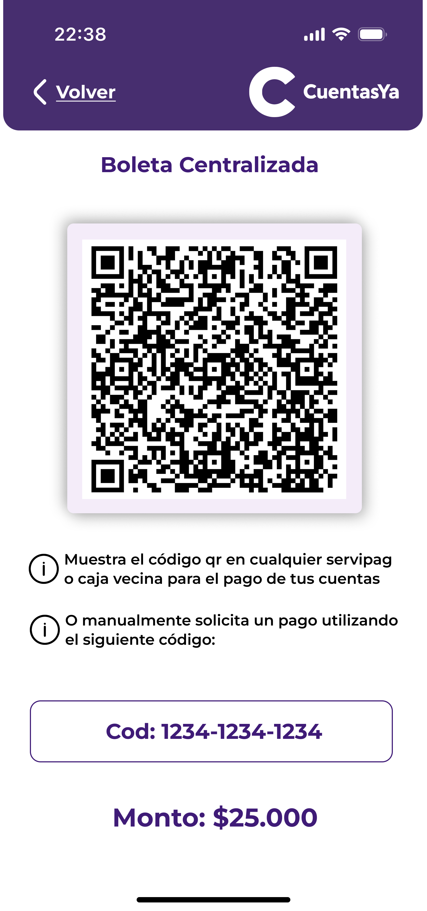
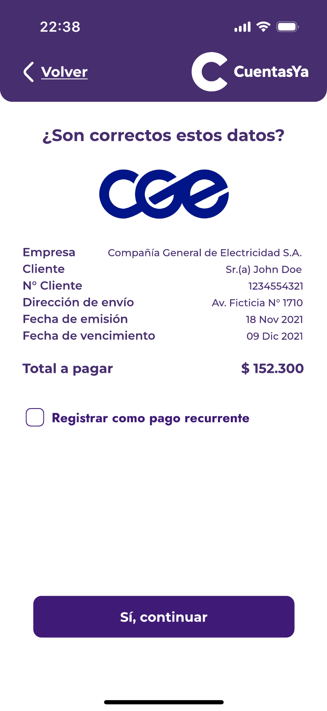
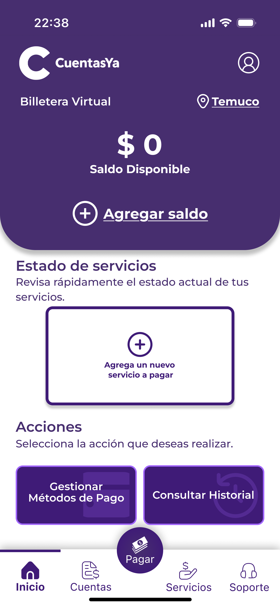

# CuentasYa

**🌐 Languages / Idiomas:** [English](README.md) | [Español](README_ES.md)

This repository contains the entire user experience process behind the app 'CuentasYa', focused on bill payment for older adults.

---
### Index

1. [Introduction](#1-introduction)
   - [1.1 Problem Statement](#11-problem-statement)
   - [1.2 Solution](#12-solution)
   - [1.3 Changes](#13-changes)
2. [Team and Roles](#2-team-and-roles)
3. [UX Design Process](#3-ux-design-process)
   - [3.1 Strategy Plane](#31-strategy-plane)
      - [3.1.1 Value Proposition Canvas](#311-value-proposition-canvas)
      - [3.1.2 Persona Canvas](#312-persona-canvas)
   - [3.2 Scope Plane](#32-scope-plane)
      - [3.2.1 Benchmark](#321-benchmark)
      - [3.2.2 Customer Journey Map](#322-customer-journey-map)
   - [3.3 Structure Plane](#33-structure-plane)
      - [3.3.1 Sitemap](#331-sitemap) (Updated)
   - [3.4 Skeleton Plane](#34-skeleton-plane)
      - [3.4.1 Wireframes](#341-wireframes)
   - [3.5 Surface Plane](#35-surface-plane) (Updated)
      - [3.5.1 Mockups](#351-mockups)
      - [3.5.2 Explanation](#352-explanation)
4. [Heuristic Evaluation Results](#4-heuristic-evaluation-results) (New)
   - [4.1 Problems](#41-problems)
   - [4.2 Solutions](#42-solutions)
5. [Accessibility Topics](#5-accessibility-topics) (New)
6. [References](#6-references)

---
### 1. Introduction

#### 1.1 Problem Statement

In the modern world, the bill payment process has changed compared to previous years, when it was necessary to go physically to the bank, regardless of the size of the matter.

Currently, we harness the advantages brought by the digitalized world, specifically the ability to put in a single application all the capabilities that, a few years ago, would have required a physical visit to a bank.

Even with these new facilities, there are still people who avoid these solutions, whether due to difficulties with technology or simply tradition—something totally normal considering how recently this technology has emerged. Whatever the case, we can recognize the significant problem of the lack of solutions focused on this segment of people: older adults.

#### 1.2 Solution

With our project, named 'CuentasYa' and inspired by the issue found, we aim to build a solution focused on senior citizens—a platform where they can centralize all their bills and cards, avoiding the need to travel physically to the banks.

The platform will be able to indicate, inside the app and with notifications and alarms, all unpaid bills. Furthermore, the main feature is bill payment, whether fully digital or by generating a centralized ticket that can be used at the bank.

#### 1.3 Changes

Based on feedback from other groups, the professor, and teaching assistants, the changes made in this new version of the project are:
* Added solutions to the observations provided by other teams after the first presentation.
* Updated the [Sitemap](#331-sitemap) with all current application flows.
* Added final [Mockups](./Documents/Mockups/Images/).
* Added an [Explanation for the Mockups](#352-explanation), grouping them by functionalities to understand the application flow and how these work together.
* Added [Heuristic Evaluation Results](#4-heuristic-evaluation-results) made by another group, with an explanation of how these were resolved.

---
### 2. Team and Roles

The team is composed of 5 members, each with a specific role in the project.

| Name             | Role             | Description                                                                 |
|------------------|------------------|-----------------------------------------------------------------------------|
| Joaquín Faúndez  | Project Manager  | Responsible for overall project management and coordination.                 |
| Sebastián Llanos | Analyst          | Responsible for analyzing user requirements, evaluating data, and translating business needs into technical specifications. |
| Javier Alcalde   | UX Designer      | Responsible for creating user interfaces, user flows, and ensuring a positive user experience throughout the application. |
| Diego Labrín     | Supporter        | Responsible for providing technical assistance, troubleshooting issues, and supporting the team with various project tasks. |
| Jesús Tapia      | Presenter        | Responsible for presenting the project and communicating its value to stakeholders. |

---
### 3. UX Design Process

#### 3.1 Strategy Plane

_"Together, product objectives and user needs form the strategy plane, the foundation for every decision in our process as we design the user experience."_ (Garrett, 2011)

##### 3.1.1 Value Proposition Canvas

In our context, to understand what we want to achieve with this application and what users want and expect from our app, we used the **Value Proposition Canvas** and **Persona Canvas** tools.

> The **Value Proposition Canvas** is a framework to ensure that there is a fit between the product and market. It is a detailed tool for modeling the relationship between two parts: customer segments and value propositions. (B2B International, 2025)

##### 3.1.2 Persona Canvas

Additionally, to understand who our user segment is, we used the **Persona Canvas** tool to define the people for whom the application is intended.

> The **Persona Canvas** is a tool that allows us to collect data about our user segment, turning this group of fragmented data into a character that represents the needs of a segment group, making users more real and not unknown.

#### 3.2 Scope Plane

_"Strategy becomes scope when you translate user needs and product objectives into specific requirements for what content and functionality the product will offer to users."_ (Garrett, 2011)

To understand what we are building, we studied competitors in the market, identifying their best features and what makes them good, as well as their worst features to avoid replicating them.

##### 3.2.1 Benchmark

Based on the information collected in the **Strategy Plane**, we developed a benchmarking analysis comparing the most well-known competitors and their functionalities, selecting the best features that match the problems we aim to solve, and adding others that can help in our domain.

> Benchmarking is defined as the process of measuring products, services, and processes against those of organizations known to be leaders in one or more aspects of their operations. (American Society for Quality, n.d.)

For more detailed information about the benchmarking analysis and competitor comparison, please visit the [Benchmark folder](Documents/Benchmark) in this repository.

##### 3.2.2 Customer Journey Map

After defining the **Persona Canvas** and the functionalities of the project, we combined these tools to build a **Customer Journey Map**. This tool helps us understand how our users will feel using the system, given the interaction between user and app.

> A **Customer Journey Map** is a visual representation of every experience that a customer has with a brand, product, or service. Ideally, a customer journey map captures the customer experience from the consumer perspective, visualizing the touchpoints, emotions, and potential pain points they encounter during their relationship with a brand. (Hayes & Downie, 2024)

#### 3.3 Structure Plane

_"The requirements, however, don’t describe how the pieces fit together to form a cohesive whole. This is the next level up from scope: developing a conceptual structure for the site."_ (Garrett, 2011)

##### 3.3.1 Sitemap

In the context of our application, we used the tool known as a Sitemap to understand the logical flow of the system through the functionalities that the system will respond to for each user interaction.

> A sitemap is a file that shows the structure of your website, including its pages and content, and the relationships between them. (Pavlik, 2024)

#### 3.4 Skeleton Plane

_"Defines what form that functionality will take. In addition to addressing more concrete issues of presentation, the skeleton plane deals with matters that involve a more refined level of detail."_ (Garrett, 2011)

##### 3.4.1 Wireframes

In our application, based on the functionalities defined in the **Sitemap**, we created views for the application using wireframes.

> A **wireframe** is a top-level blueprint that illustrates the structure of your website, app, or project. It doesn’t include any designs or a great deal of detail. It simply maps the structure and the key elements. (Miro, 2025)

   
   
   
   

To see all the wireframes, due to the high number of images, go directly to the [Wireframes Lo-Fi folder](/Documents/Wireframes).

#### 3.5 Surface Plane

_"The surface plane is the most visible part of the user experience. It’s what users see and interact with. The surface plane is where the visual design comes into play."_ (Garrett, 2011)

##### 3.5.1 Mockups

To see all the mockup images, due to the high number of images, go directly to the [Hi-fi Wireframes (Mockups) folder](Documents/Mockups) or to the [Figma link](https://www.figma.com/design/TZPs4cJEpcQoUkov2iKeuV/Cuentas-YA?node-id=178-308&t=HpcX7A2NsWgQR3cF-1).

  
  
  

##### 3.5.2 Explanation

If you want an explanation about the mockups grouped by their functionalities, go to the following [link](./Documents/Mockups/Explanation-EN/01.Register-Login.md), where you will find the explanation based on the application flow.

---
### 4. Heuristic Evaluation Results

Considering the heuristic evaluation made by another team, the 'CuentasYa' team used the problems found by this external team to strengthen the application.

#### 4.1 Problems

* In the main dashboard, the "State of Services" section is not intuitive; unpaid services show values, while paid services appear crossed out, which can be confusing.
* The summary screen should include a pay button, to allow users to pay their debt using the app's digital wallet or another method.
* The scan functionality UI is confusing because the view suggests the bill must fit exactly, which may generate errors.
* It is unclear how to add money to the wallet, as it only allows adding cards.
* The UI doesn't specify how bills are displayed, causing confusion about whether they are current charges or previously added services.

#### 4.2 Solutions

* Now, the states of the services in the upper right corner and the color of the price show a specific color for each state:
  * Red for unpaid bills
  * Green for paid bills

   

* The application now shows the summary view with a button to proceed, where the app asks the user if they want to pay immediately or do it later.

   
   

* The scan screen no longer shows limiters, leveraging AI capabilities to analyze the image.

   

* The main dashboard now features a prominent button that allows the user to add money to the digital wallet. Additionally, the digital wallet has another view for adding money.

   
   
   

---

### 5. Accessibility Topics

In the development of CuentasYa, the following accessibility aspects were considered (Quesenbery, S. H. & W, 2024), based on class workshops and UX best practices:

- **Color contrast and readability:** High-contrast colors and an accessible palette were used for people with low vision or color blindness. Important texts and buttons comply with UX standards.
- **Size and clarity of interactive elements:** Buttons and touch areas are large and easily identifiable, making them easier to use for people with reduced mobility or motor difficulties.
- **Typography and visual hierarchy:** Legible fonts and appropriate sizes for older adults were used, prioritizing clarity and visual hierarchy.
- **Iconography and visual support:** Clear and universal icons were used alongside texts, and alternative texts were considered for screen reader users.
- **Feedback and confirmations:** The application provides clear visual feedback (colors, messages, states) for important actions, including confirmation messages and alerts to prevent errors.
- **Clear and simple language:** Simple, direct, and jargon-free language was prioritized, making it easier to understand for older adults and people with lower digital literacy.

To see these changes in more detail, check the mockups available in the [Hi-Fi Wireframes (Mockups) folder](Documents/Mockups) or access the [Figma project](https://www.figma.com/design/TZPs4cJEpcQoUkov2iKeuV/Cuentas-YA?node-id=178-308&t=HpcX7A2NsWgQR3cF-1).

---

### 6. References

- Garrett, J. J. (2011). The Elements of User Experience: User-Centered Design for the Web and Beyond. New Riders.
- B2B International. (2025). Value Proposition Canvas. Retrieved from https://www.b2binternational.com/research/methods/faq/what-is-the-value-proposition-canvas/
- American Society for Quality. (n.d.). Benchmarking. Retrieved from https://asq.org/quality-resources/benchmarking
- Hayes, M., & Downie, A. (2024, October 11). Customer journey map. Retrieved from https://www.ibm.com/think/topics/customer-journey-map
- Pavlik, V., Shirlow, C., & Mustapic, B. (2024). What Is a Sitemap? Website Sitemaps Explained. Semrush Blog. Retrieved from https://www.semrush.com/blog/website-sitemap
- What is a Wireframe & its Role in the Design Process | Miro. (2025, May 25). Retrieved from https://miro.com/wireframe/what-is-a-wireframe
- Quesenbery, S. H. & W. (2024). Principles for Accessibility. Design Principles. Retrieved from https://principles.design/examples/principles-for-accessibility
- Figma repository: https://www.figma.com/design/TZPs4cJEpcQoUkov2iKeuV/Cuentas-YA?node-id=178-308&t=HpcX7A2NsWgQR3cF-1
