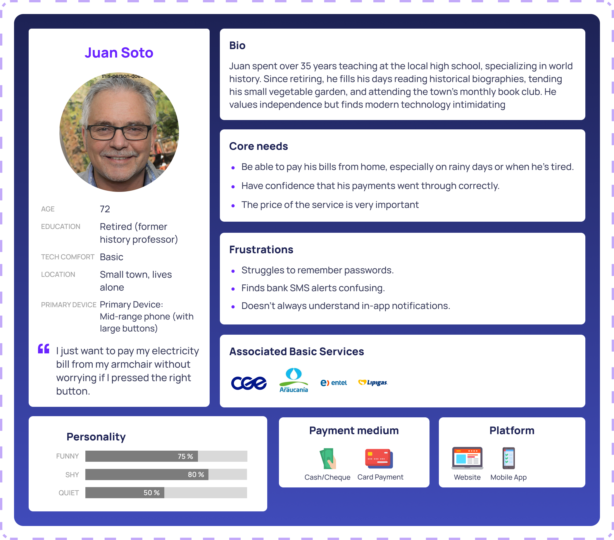
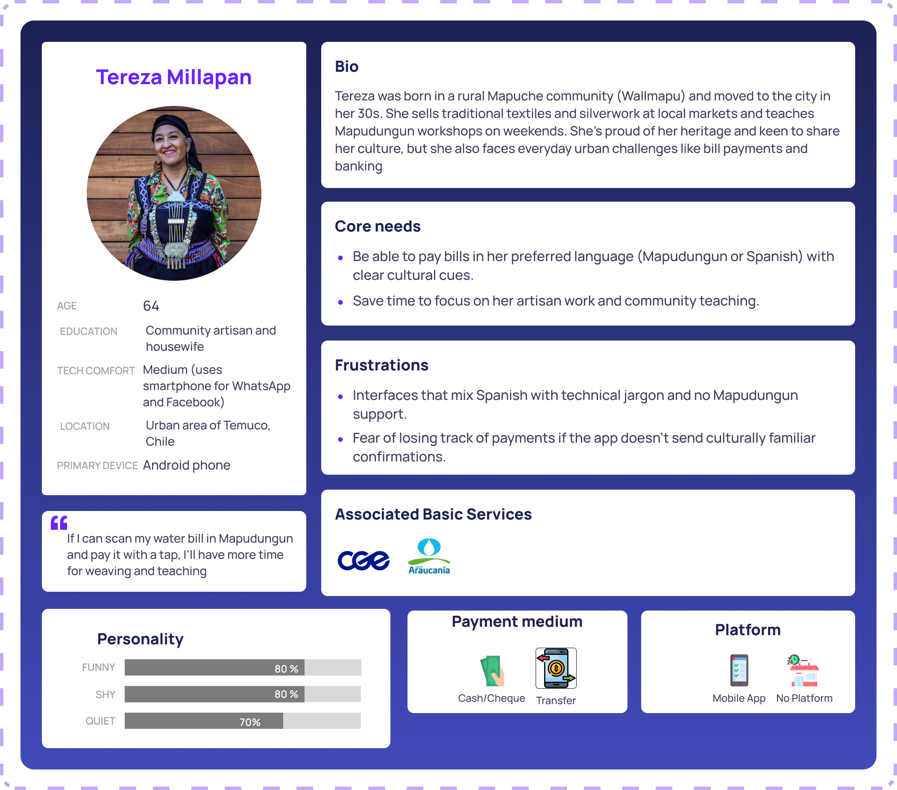
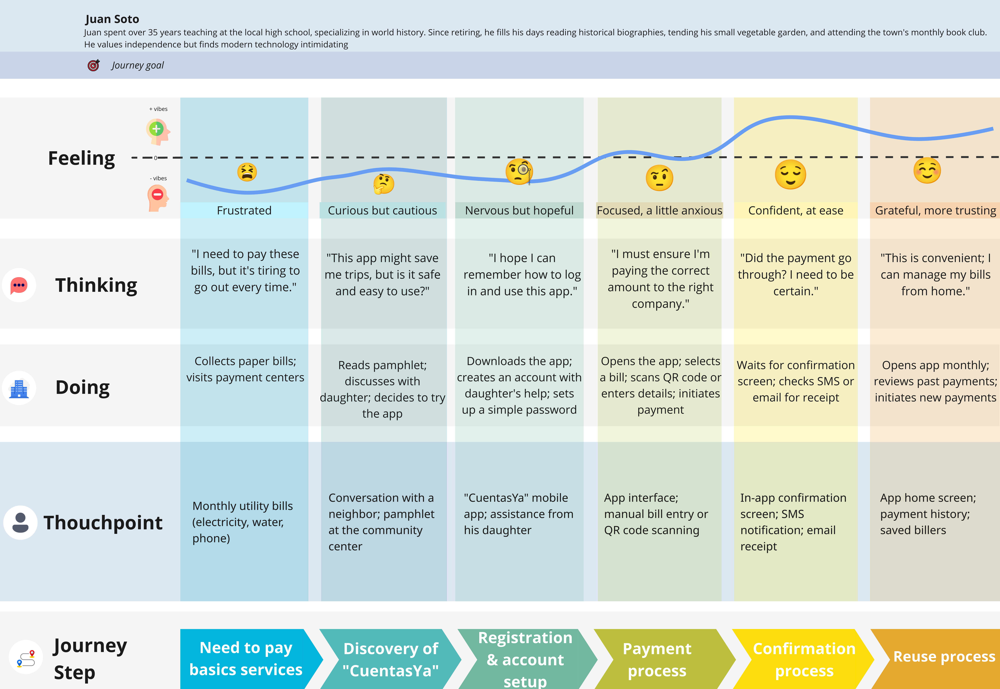
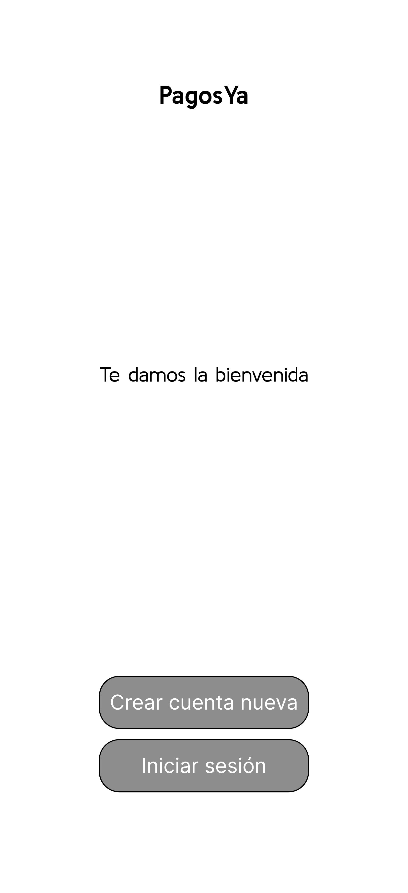
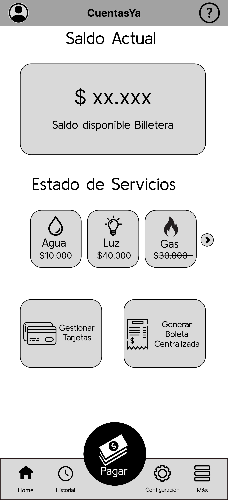
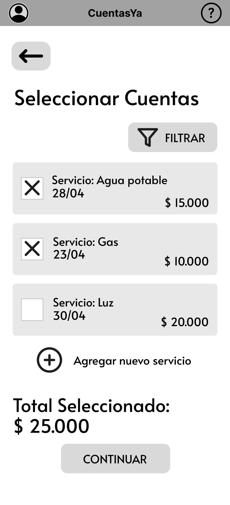

# CuentasYa

**🌐 Languages / Idiomas:** [English](README.md) | [Español](README_ES.md)

Este repositorio contiene todo el proceso de experiencia de usuario detrás de la aplicación 'CuentasYa', enfocada en el pago de cuentas para adultos mayores.

--- 
### Índice 

1. [Introducción](#1-introducción)
   - [1.1 Problemática](#11-problemática)
   - [1.2 Solución](#12-solución)
2. [Equipo y Roles](#2-equipo-y-roles)
3. [Proceso de Diseño UX](#3-proceso-de-diseño-ux)
   - [3.1 Plano de Estrategia](#31-plano-de-estrategia)
   - [3.2 Plano de Alcance](#32-plano-de-alcance)
   - [3.3 Plano de Estructura](#33-plano-de-estructura)
   - [3.4 Plano de Esqueleto](#34-plano-de-esqueleto)
   - [3.5 Plano de Superficie](#35-plano-de-superficie)
4. [Referencias](#4-referencias)

--- 
### 1. Introducción 

##### 1.1 Problemática
En el mundo moderno, el proceso de pago de cuentas ha cambiado comparado con años anteriores, donde era necesario ir físicamente a los bancos, sin importar el tamaño del asunto.

Actualmente, aprovechamos las ventajas que trae el mundo digitalizado, específicamente, la capacidad de poner en una sola aplicación todas las capacidades que hace unos años, sería necesario atender físicamente en un banco.

En este contexto, aún con estas nuevas facilidades, todavía hay personas que evitan estas soluciones, ya sea por dificultades con la tecnología o simplemente por tradición, algo totalmente normal considerando lo reciente que ha surgido esta nueva tecnología. Sea cual sea el caso, podemos reconocer el gran problema de la falta de soluciones enfocadas en este segmento de personas, los adultos mayores.

##### 1.2 Solución  
Con nuestro proyecto, llamado 'CuentasYa' inspirado en el problema encontrado, buscamos construir una solución enfocada en nuestros ciudadanos de la tercera edad, una plataforma donde puedan centralizar todas sus cuentas y tarjetas, evitando la necesidad de viajar físicamente a los bancos.

La plataforma será capaz de indicar dentro de la aplicación y con notificaciones y alarmas, todas las cuentas no pagadas. Además, la característica principal es el pago de cuentas, ya sea completamente digital o generando un ticket centralizado que puede ser usado en el banco.

---
### 2. Equipo y Roles

El equipo está compuesto por 5 miembros, cada uno con un rol específico en el proyecto.
| Nombre           | Rol                       | Descripción                                                                 |
|------------------|---------------------------|-----------------------------------------------------------------------------|
| Joaquín Faúndez  | Gerente de Proyecto       | Responsable de la gestión general del proyecto y coordinación.             | 
| Sebastián Llanos | Analista                  | Responsable de analizar los requisitos del usuario, evaluar datos y traducir las necesidades del negocio en especificaciones técnicas. |
| Javier Alcalde   | Diseñador UX              | Responsable de crear interfaces de usuario, flujos de usuario y asegurar una experiencia de usuario positiva en toda la aplicación. |
| Diego Labrín     | Soporte                   | Responsable de proporcionar asistencia técnica, solucionar problemas y apoyar al equipo con varias tareas del proyecto. |
| Jesús Tapia      | Expositor                 | Responsable de presentar el proyecto y comunicar su valor a los interesados. |

---
### 3. Proceso de Diseño UX

#### 3.1. Plano de Estrategia

_"Juntos, los objetivos del producto y las necesidades del usuario forman el plano de estrategia, la base para cada decisión en nuestro proceso mientras diseñamos la experiencia del usuario."_ (Garrett, 2011)

En nuestro contexto, para entender qué queremos lograr con esta aplicación, y qué quieren y esperan los usuarios de nuestra app, utilizamos las herramientas llamadas **Canvas de Propuesta de Valor** y **Canvas de Persona**.

> El **Canvas de Propuesta de Valor** es un marco de trabajo para asegurar que hay un ajuste entre el producto y el mercado. Es una herramienta detallada para modelar la relación entre dos partes: segmentos de clientes y propuestas de valor. (B2B International, 2025)

Adicionalmente, para entender quiénes son nuestro segmento de usuarios, utilizamos la herramienta llamada **Canvas de Persona**, para entender quiénes son las personas para las cuales está destinada la aplicación.

> El **Canvas de Persona** es una herramienta que permite recopilar datos sobre nuestro segmento de usuarios, haciendo que este grupo de datos fragmentados se convierta en un personaje que representa las necesidades de un grupo segmentado, generando que los usuarios sean más reales y no desconocidos.

#### 3.2. Plano de Alcance

_"La estrategia se convierte en alcance cuando traduces las necesidades del usuario y los objetivos del producto en requisitos específicos para qué contenido y funcionalidad ofrecerá el producto a los usuarios."_ (Garrett, 2011)

En el plano de alcance, para entender qué estamos construyendo, estudiamos los competidores presentes en el mercado, identificando sus mejores características y qué los hace buenos, y sus peores características para no replicarlas.

Para hacer esto, basándonos en la información recopilada en el **plano de estrategia**, desarrollamos un benchmarking que compara los competidores más famosos y sus funcionalidades, seleccionando las mejores funcionalidades que pueden coincidir con los problemas que tratamos de resolver, agregando otras que pueden funcionar y ayudar en nuestro problema de dominio.

> El Benchmarking se define como el proceso de medir productos, servicios y procesos contra aquellos de organizaciones conocidas por ser líderes en uno o más aspectos de sus operaciones. (American Society for Quality, n.d.)

Para información más detallada sobre el análisis de benchmarking y comparación de competidores, por favor visita la [carpeta Benchmark](Documents/Benchmark) en este repositorio.

Materializado el **Canvas de Persona**, y definidas las funcionalidades del proyecto, mezclamos estas dos herramientas para construir un **Mapa de Viaje del Cliente**, una herramienta que nos permite entender cómo se van a sentir nuestros usuarios usando el sistema, dada la interacción entre usuario y aplicación.

> Un **Mapa de Viaje del Cliente** es una representación visual de cada experiencia que un cliente tiene con una marca, producto o servicio. Idealmente, un mapa de viaje del cliente captura la experiencia del cliente desde la perspectiva del consumidor, visualizando los puntos de contacto, emociones y posibles puntos de dolor que encuentran durante su relación con una marca. (Hayes & Downie, 2024)

#### 3.3. Plano de Estructura 

_"Los requisitos, sin embargo, no describen cómo las piezas encajan juntas para formar un todo cohesivo. Este es el siguiente nivel después del alcance: desarrollar una estructura conceptual para el sitio."_ (Garrett, 2011)

En el contexto de nuestra aplicación, utilizamos la herramienta conocida como Mapa del Sitio, para entender el flujo lógico del sistema a través de las funcionalidades que el sistema responderá a cada interacción del usuario.

> Un mapa del sitio es un archivo que muestra la estructura de tu sitio web, incluyendo sus páginas y contenido. Y las relaciones entre ellas. (Pavlik, 2024)

#### 3.4. Plano de Esqueleto 
_"Define qué forma tomará esa funcionalidad. Además de abordar problemas más concretos de presentación, el plano de esqueleto trata asuntos que involucran un nivel más refinado de detalle"_ (Garrett, 2011)

En nuestras aplicaciones, basándonos en las funcionalidades definidas en el **Mapa del Sitio**, creamos vistas para la aplicación usando wireframes.

> Un **wireframe** es un plano de alto nivel que ilustra la estructura de tu sitio web, aplicación o proyecto. No incluye ningún diseño o gran cantidad de detalles. Simplemente mapea la estructura y los elementos clave. (Miro, 2025).

   
   
   
   

Para ver todos los wireframes, debido al alto número de imágenes, ir directamente a la [carpeta con los Wireframes Lo-Fi](/Documents/Wireframes).

#### 3.5. Plano de Superficie

_"El plano de superficie es la parte más visible de la experiencia del usuario. Es lo que los usuarios ven e interactúan. El plano de superficie es donde entra en juego el diseño visual."_ (Garrett, 2011)

   
   
   
   

Para ver todos los wireframes Hi-Fi, debido al alto número de imágenes, ir directamente a la
[carpeta con los wireframes Hi-Fi (Mockups)](Documents/Mockups) o al link hacia [figma](https://www.figma.com/design/TZPs4cJEpcQoUkov2iKeuV/Cuentas-YA?node-id=178-308&t=HpcX7A2NsWgQR3cF-1)

---
### 4. Referencias

- Garrett, J. J. (2011). The Elements of User Experience: User-Centered Design for the Web and Beyond. New Riders.
- B2B International. (2025). Value Proposition Canvas. Recuperado de https://www.b2binternational.com/research/methods/faq/what-is-the-value-proposition-canvas/
- American Society for Quality. (n.d.). Benchmarking. Recuperado de https://asq.org/quality-resources/benchmarking
- Hayes, M., & Downie, A. (2024, 11 de octubre). Customer journey map. Recuperado de https://www.ibm.com/think/topics/customer-journey-map
- Pavlik, V., Shirlow, C., & Mustapic, B. (2024). What Is a Sitemap? Website Sitemaps Explained. Semrush Blog. Recuperado de https://www.semrush.com/blog/website-sitemap
- What is a Wireframe & its Role in the Design Process | Miro. (2025, 25 de mayo). Recuperado de https://miro.com/wireframe/what-is-a-wireframe

- Link Repositorio de Figma: https://www.figma.com/design/TZPs4cJEpcQoUkov2iKeuV/Cuentas-YA?node-id=178-308&t=HpcX7A2NsWgQR3cF-1

---
